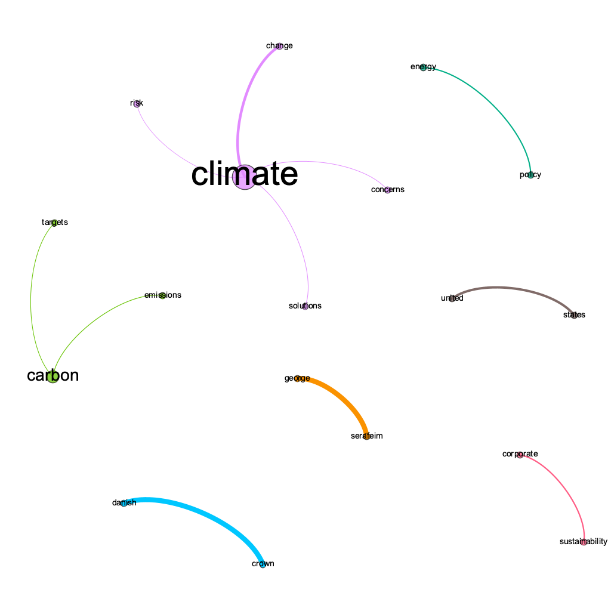

# Taxonomy & Info Architecture Task

## Methodology
1. Twenty-one sample abstracts were parsed into individual documents using an XQuery program in the [BaseX](basex.org) platform.
1. Citations and abstracts were parsed into different elements.
1. A set of 42 text files was generated from the citation and abstract elements within the documents.
1. The text files were used to create a dataset for analysis within the [Distant Reader Toolbox](https://reader-toolbox.readthedocs.io/en/latest/index.html) (DRT), a command-line tool for text analysis.
1. The dataset was examined using the available DRT algorithms, including topic modeling, entity recognition, concept clustering, and term co-occurrence.
1. The simple network graph below shows the output of the DRT collocation algorithm for term co-occurrence.
1. Analysis of the graph suggested that an entity-driven approach to metadata modeling and concept scheme development for the project would be appropriate.
1. Entities to be incorporated include:
    - Concepts
    - Events
    - Groups
    - Objects (media type)
    - People
    - Places
    - Time periods
    - Works (document type)
1. The [Linked Art](linked.art) metadata model was chosen because of its ability to leverage concept schemes within an entity-driven framework.
1. [DITA](https://www.oasis-open.org/committees/tc_home.php) (Darwin Information Typing Architecture) documents were generated for the dataset documents to facilitate hand-coded markup of concepts.
1. The sample concept scheme was developed using the [TemaTres](https://vocabularyserver.com/web/) and [PoolParty](https://enterprise.poolparty.biz/PoolParty/) platforms.
1. Markdown documentation for the concept scheme was generated using the [pyLODE](https://github.com/RDFLib/pyLODE) tool.

## Deliverables
1. [Climate change concept scheme](https://github.com/timathom/Taxonomy-Info-Architecture-Candidate-Task/blob/main/concepts/climate_change.md). An example SKOS concept scheme with six top concepts that may be leveraged as user interface facets for browsing:
    - Actors
    - Challenges
    - Topics
    - Industries
    - Solutions
    - Technologies
2. [Metadata documents](https://github.com/timathom/Taxonomy-Info-Architecture-Candidate-Task/tree/main/metadata). 
    - Example Linked Art descriptions of a document entity, an event entity, and a person entity.
    - Two example DITA documents with hand-coded markup of concepts and entities.
